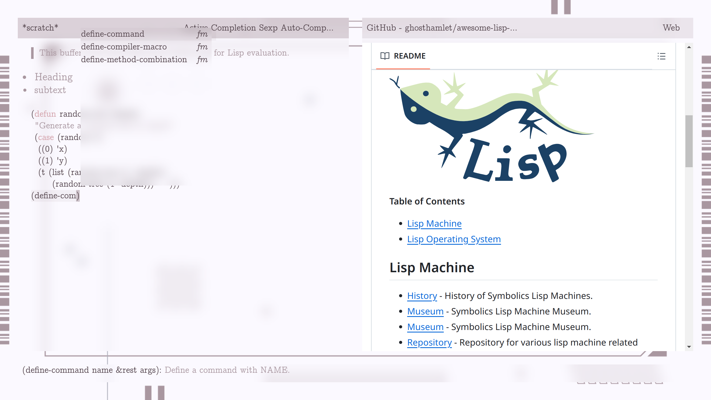
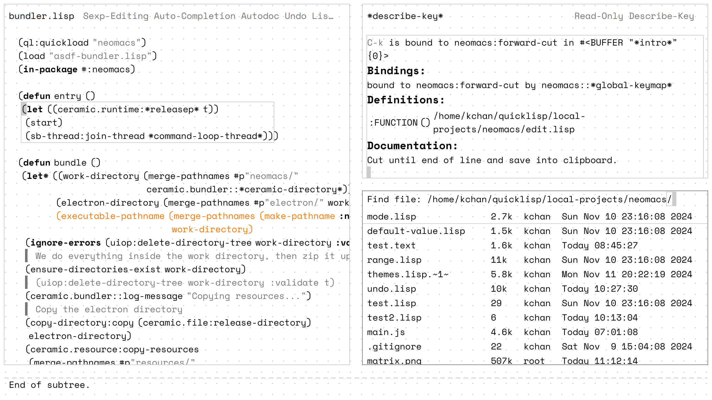

> The fractal flowers and recursive roots:
> the most lovely hack I've seen.
>                    -- God wrote in Lisp, by Bob Kanefsky and Julia Ecklar

Neomacs is a computing environment based on structural
editing. Neomacs aims to become the Emacs of trees. Currently, Neomacs
is a usable Lisp IDE and keyboard-driven browser.

# Get started

Prebuilt binary for x64 Linux: https://github.com/neomacs-project/neomacs/releases/

Documentation: `M-x manual`. There is also an online version at https://neomacs-project.github.io/doc/toc.html

To build locally, make sure you have SBCL, quicklisp, and the Ultralisp dist (if you haven't done so, `(ql-dist:install-dist "http://dist.ultralisp.org/" :prompt nil)`). Clone this repo and `https://github.com/ceramic/ceramic` under `~/quicklisp/local-projects/`. Then `(ql:quickload "neomacs")` and `(neomacs:start)`.

To build the terminal emulator (currently Linux only), clone `https://github.com/neomacs-project/3bst` under `~/quicklisp/local-projects/` then `(ql:quickload "neomacs/term")`.

Neomacs relies on Electron which has known permission issues on some Linux distros. Try the following workaround:

1. `sudo sysctl -w kernel.apparmor_restrict_unprivileged_userns=0`
2. `sudo sysctl kernel.unprivileged_userns_clone=1`
3. `sudo chown root electron/chrome-sandbox && sudo chmod 4755 electron/chrome-sandbox` For prebuilt binary, run this under `bin` directory from uncompressing the archive. For `quickload`ed Neomacs, run this under `~/.ceramic`.

If you are troubleshooting some Neomacs bug, `(neomacs:start nil)` might be helpful. It turns off built-in debugger and stream redirections and hand it over to external IDE (e.g. SLIME).

# Screenshots

Two built-in themes, accessible via `M-x apply-theme`:

# Contributing

If you have any question, suggestions, ideas, crazy or not, feel free
to post them in the issues or discussions! If you have a patch, don't
hesitate to open a PR! We welcome creativity!
